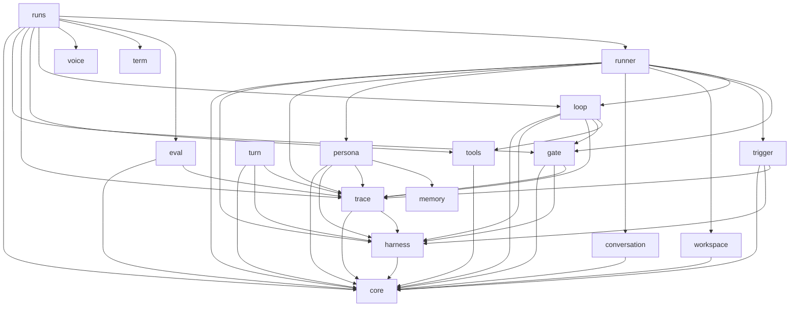

# mg

A workbench for trying out harnesses for LLM-driven agents.

## Overview

A harness is what connects an LLM to tools so it can get work done.

This repository builds a base where harnesses can be measured and
improved over and over. On that base, it works on form-focused harnesses.

Harnesses split into two kinds by what they aim for: outcome and form.

| Kind    | Aims for                                         | Ends? | Measured by                           |
| ------- | ------------------------------------------------ | ----- | ------------------------------------- |
| Outcome | The task gets done correctly                     | Yes   | Scoring the final state by machine    |
| Form    | Consistent voice, memory and conversation format | No    | A person or an LLM judging the output |

## Quick start

Run every command from the repository root.

```sh
pnpm install
pnpm build
node --env-file-if-exists=.env runs/example.ts
```

API keys are read from the process environment.
If a `.env` file exists, they are read from it as well.

## Packages

| Package                                               | What it does                                                                                                                           |
| ----------------------------------------------------- | -------------------------------------------------------------------------------------------------------------------------------------- |
| [`@mg/core`](packages/core/README.md)                 | Provider abstraction and shared tool types                                                                                             |
| [`@mg/tools`](packages/tools/README.md)               | Built-in tools shared by harnesses                                                                                                     |
| [`@mg/workspace`](packages/workspace/README.md)       | Connector types for reaching other machines, and opening and closing workspaces                                                        |
| [`@mg/conversation`](packages/conversation/README.md) | Interface, types and errors for storing and loading conversations                                                                      |
| [`@mg/memory`](packages/memory/README.md)             | Stores and loads an individual's memory (persona, per-person entries, summaries)                                                       |
| [`@mg/persona`](packages/persona/README.md)           | Interfaces for an individual's recall and reflection, and an LLM-backed implementation                                                 |
| [`@mg/gate`](packages/gate/README.md)                 | Gate types that decide whether an action may run, with LLM and Estimator implementations                                               |
| [`@mg/trigger`](packages/trigger/README.md)           | Trigger types and errors that decide whether to start a run, span helpers, and an Estimator implementation                             |
| [`@mg/harness`](packages/harness/README.md)           | Shared input and output types every harness follows, and the subagent interface                                                        |
| [`@mg/trace`](packages/trace/README.md)               | Tracing implementation and the shared vocabulary                                                                                       |
| [`@mg/loop`](packages/loop/README.md)                 | A loop harness that keeps calling tools                                                                                                |
| [`@mg/runner`](packages/runner/README.md)             | Builds a harness from a config, opens a trace and runs it                                                                              |
| [`@mg/eval`](packages/eval/README.md)                 | Interface for judging a run from its records afterwards, with rule and Estimator implementations                                       |
| [`@mg/term`](packages/term/README.md)                 | Colors and markers for terminal output                                                                                                 |
| [`@mg/voice`](packages/voice/README.md)               | Voice I/O types (chunks, speech synthesis, transcription, listener, player), sentence splitting, and a speech synthesis implementation |
| [`@mg/turn`](packages/turn/README.md)                 | Types and errors for the listening decisions ①–⑥ in voice conversations, and an Estimator implementation                               |
| [`@mg/dashboard`](dashboard/README.md)                | Screens, storage and startup needed only for everyday use                                                                              |
| [`runs/`](runs/)                                      | Config files for each experiment                                                                                                       |

### Where new code goes

| What you are adding                                                              | Where                                        |
| -------------------------------------------------------------------------------- | -------------------------------------------- |
| An implementation of another provider                                            | core                                         |
| Tool types or the tool runner                                                    | core                                         |
| Tools shared by harnesses                                                        | tools                                        |
| A tool used by only one harness                                                  | that harness (written with core's types)     |
| The subagent interface                                                           | harness                                      |
| A connector to another machine                                                   | workspace                                    |
| A gate implementation that decides whether an action may run                     | gate                                         |
| A trigger implementation that decides whether to start a run                     | trigger                                      |
| Repeating tool calls                                                             | loop                                         |
| How validation failures are reported to the LLM                                  | loop                                         |
| Tracing vocabulary and exporters                                                 | trace                                        |
| The post-run judging interface, and rule and Estimator implementations           | eval                                         |
| Colors and markers for terminal output                                           | term                                         |
| Per-experiment wiring configs                                                    | runs                                         |
| Judging rules, question contents and thresholds                                  | runs                                         |
| Screens, storage and startup needed only for everyday use                        | dashboard                                    |
| How runs are executed (opening and closing traces, batches, loading)             | runner                                       |
| Building subagents from a config                                                 | runner                                       |
| The conversation storage interface and implementations                           | conversation                                 |
| An individual's memory (storage)                                                 | memory                                       |
| An individual's recall and reflection                                            | persona                                      |
| Voice I/O types                                                                  | voice                                        |
| Speech synthesis and transcription implementations                               | voice                                        |
| Splitting text into sentences to speak                                           | voice                                        |
| Conversation decisions (backchannels, stopping, etc.): types and implementations | turn                                         |
| How an individual delivers replies                                               | undecided (settled when that design is done) |

When in doubt, check whether it depends on the environment.
Anything environment-dependent, such as child processes, stays out of core.

## Architecture

Package dependencies. Arrows point from the user to the package it uses.



- eval sits outside the run itself. It connects only when reading
  traces back after a run.
- runner does not use tools, eval or memory. An individual's storage
  lives inside the individual.
- memory and persona do not know about runner.
- core, memory, term and voice depend on no other package in this
  repository.
- turn does not know about voice.
- runs and dashboard are consumers and do not use each other.
  dashboard uses no package yet, and no package uses dashboard. Its
  server, pages and styles come from outside libraries only (Hono,
  React, Tailwind).

## Development

Run every command from the repository root.
Build and checks run across all packages.

```sh
pnpm install       # install dependencies
pnpm build         # build
pnpm typecheck     # check types
pnpm test          # run tests
pnpm lint          # find code problems
pnpm lint:fix      # fix what can be fixed
pnpm format        # format
pnpm format:check  # find formatting drift
```

lint uses type information, so run build first.
Without build output, types do not resolve and lint reports false
problems.

runs is type-checked but not built.

A formatter runs right before each commit.
It only touches files in the commit, and the formatted result is
committed as is.

To skip formatting when in a hurry, add this flag.

```sh
git commit --no-verify
```
